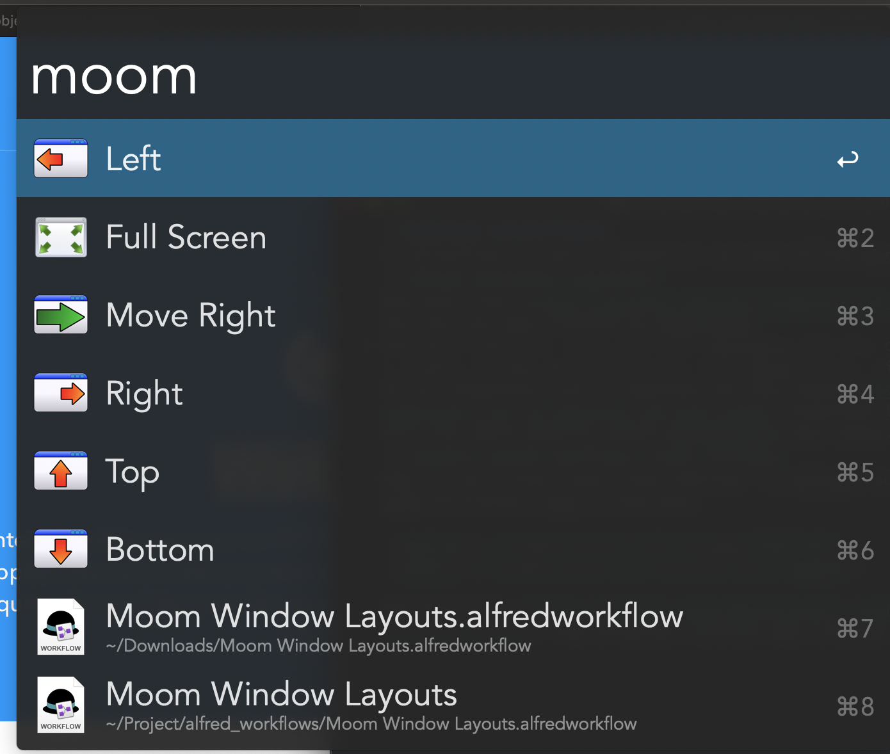
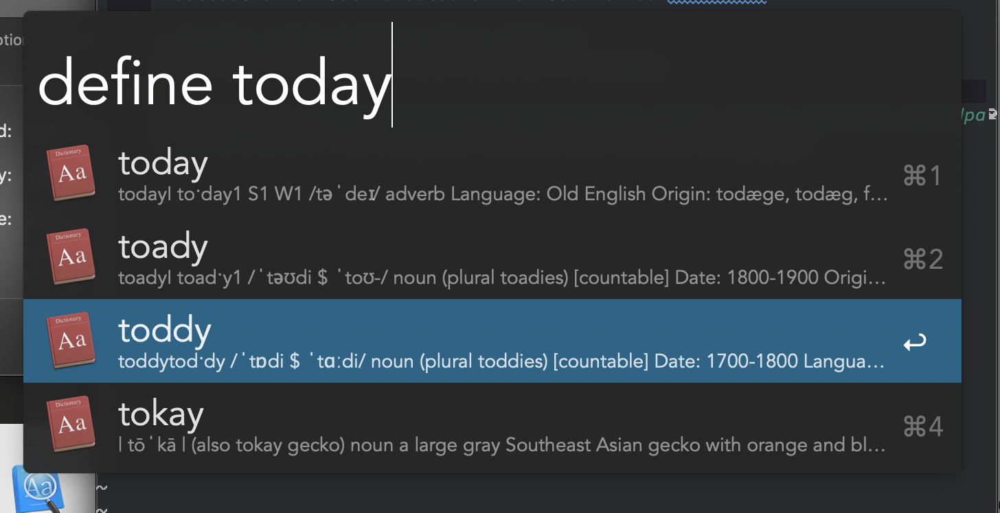
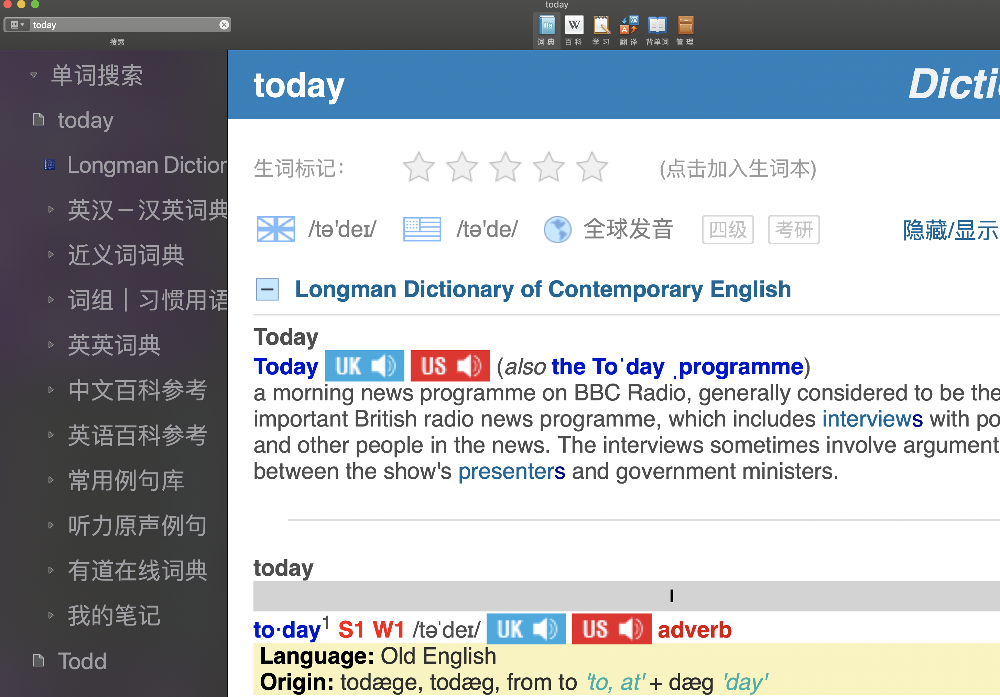

# alfred_workflows
A collection of self-created or revised Alfred workflows
## Moom Window Layouts
Revised from <https://github.com/SteliosHa/Alfred_Moom_Interface>. The original version was created by SteliosHa.
Add more modifier keys and both keystore and key code supports, which make it enable to map more shortcuts from Moom. Also, simplify the user flow.

Go to [Complete list of AppleScript key codes](https://eastmanreference.com/complete-list-of-applescript-key-codes "Complete list of AppleScript key codes") for more details about AppleScript key codes.
## Eudic with define list filter
Add a list filter just like "define" in Alfred, but using Eudic instead of macOS Dictionary App in the end.

Revised from [https://github.com/cdpath/eudic_tools](https://github.com/cdpath/eudic_tools). The original version was created by cdpath.

## Send request to IFTTT Webhooks
This workflow can toggle 3rd party service binding to IFTTT. I use it to control my TP-Link Smart Plug. You need to bind the service with IFTTT and create your own Webhooks to connect the workflow with it. Make sure to change the python code to make it corresponding with your Webhooks config.
